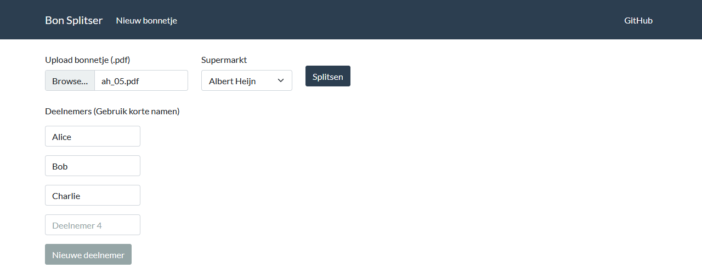
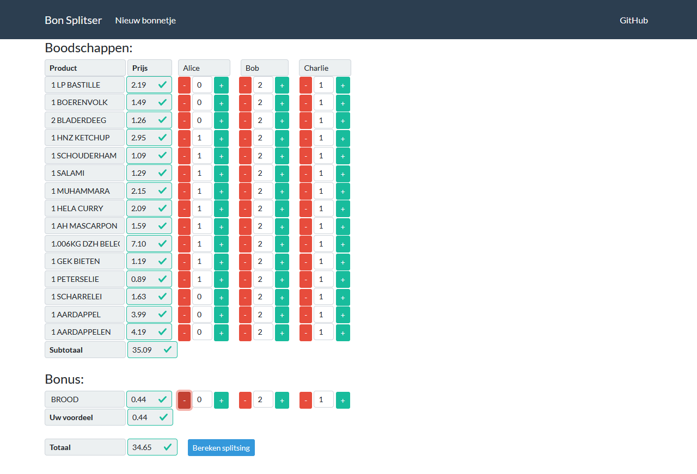
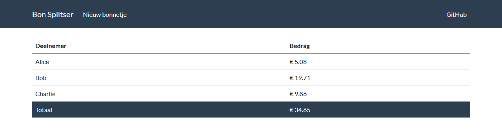

# Bon splitser
This tool allows you to split a receipt from the Albert Heijn supermarket across multiple people. It uses optical character recognition to read the receipt and provides an web interface to split the receipt.

## Installation
1. Install Tesseract OCR 5.x (for windows use https://digi.bib.uni-mannheim.de/tesseract/)
2. Download "nld.traineddata" from https://github.com/tesseract-ocr/tessdata. Place the file in Tesseract-OCR\tessdata
3. Install python packages from "requirements.txt"

## Usage
1. Clone project and cd to project dir
2. In your terminal "flask run" see https://flask.palletsprojects.com/en/2.0.x/quickstart/
3. Go to http://127.0.0.1:5000/ (does not work well with narrow displays)
4. Download your receipt pdf from the Albert Heijn app or use the example pdf from the "test_data" directory
5. Upload the receipt pdf and enter the names of the participants

6. Select which participant is paying for what

7. The receipt is split

